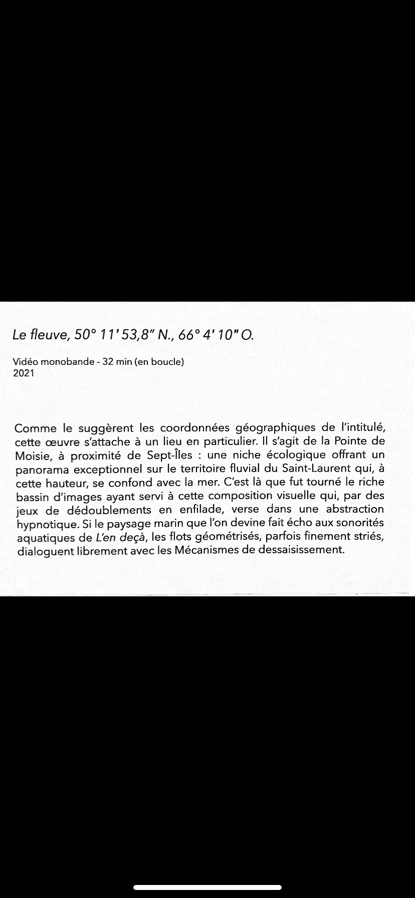
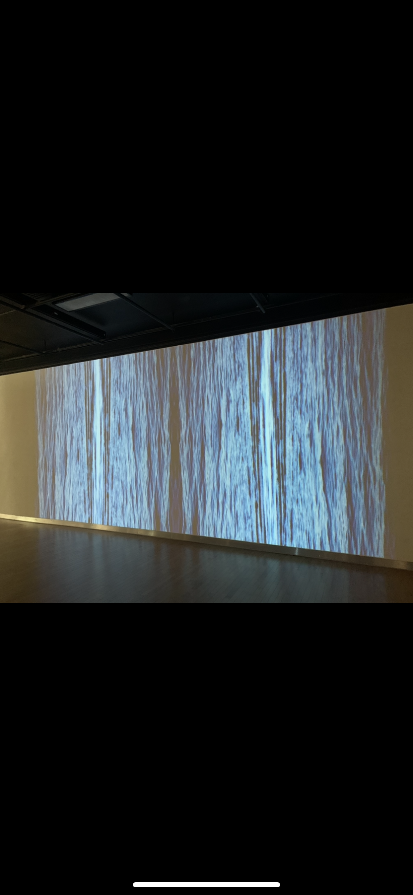
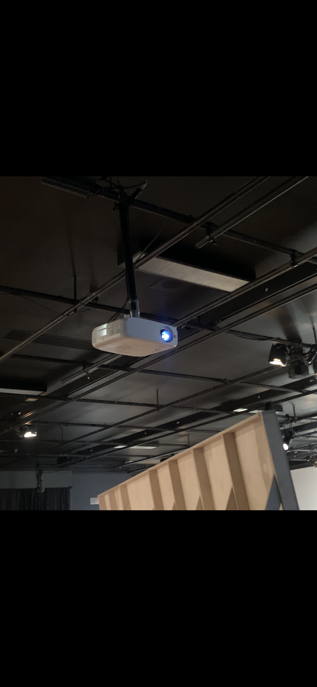

# Titre de l'oeuvre ou de la réalisation
## Le fleuve
# Nom de l'artiste ou de la firme
## le duo Béchard Hudon (Catherine Béchard et Sabin Hudon)
# Année de réalisation
## 2021
# Nom de l'exposition ou de l'événement
## Configurations du sensible - Béchard Hudon
# Lieu de mise en exposition
## Maison des arts de Laval,Québec,Canada,Salle Alfred Pellan
# Date de votre visite
## 16 mars 2022
# Description de l'oeuvre ou du dispositif multimédia 

## Cette photo de ce cartel a été prise lors de ma visite de l'exposition Béchard Hudon dans la Salle Alfred Pellan de la Maison des arts de Laval. 
# Explications sur la mise en espace de l'oeuvre ou du dispositif
## Le fleuve est une oeuvre immersive visuelle qui est exposée sur un mur blanc à l'aide d'un projecteur. Quand nous l'observons les spectateurs peuvent se laisser emporter par elle. Cette oeuvre laisse les spectateurs qui y assitent à s'imaginer ce que sa pourrait bien representé.Par exemple, pour ma part à certains endroits je voyais comme si c'etait des courant d'électricité qui se joignaient tandis que réellement lorsque les spectateurs panchent leur tête sur le côté nous pouvons voir que ce sont tout simplement des vagues d'océan.
## Une photo de l'oeuvre

# Liste des composantes et techniques de l'oeuvre ou du dispositif (ex. : réalité virtuelle, projecteurs, caméra USB, anneau lumineux...)
## Installations du projecteur pour pouvoir diffuser le projet Le fleuve sur le mur blanc.

# Liste des éléments nécessaires pour la mise en exposition (ex. : crochets, sac de sable, câbles de soutien...)
## Cette installation permet de diffuser l'oeuvre sur le mur.

# Expérience vécue :
## En ce qui me concerne,cette oeuvre immersive visuelle a vraiment réussit à me captivé. J'étais plongé dedans ce qui a pu me permettre d'imaginer plusieurs choses dont le fait que moi je pensais au tout début que c'était des courants d'électricité mais en penchant notre tête nous pouvons clairement distinguer que ce sont des vagues d'un fleuve en boucle.
## Description de votre expérience de l'oeuvre ou du dispositif, de l'interactivité, des gestes à poser, etc

# Ce qui vous a plu, vous a donné des idées et justifications
## Ce qui m'a plu réellement avec cette oeuvre,c'est le fait que nous ne remarquons pas que ce sont des vagues d'un fleuve en boucle dès l'instant que nous l'obersons, ce qui laisse un mystère au visiteur.

# Aspect que vous ne souhaiteriez pas retenir pour vos propres créations ou que vous feriez autrement et justifications
## J'aurais aimé avoir eu beaucoup plus d'interraction avec cette oeuvre.
# Références:

## Le cartel de l'oeuvre

