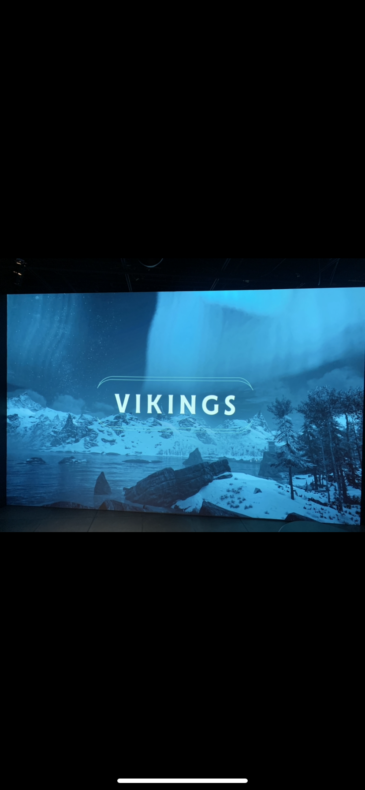
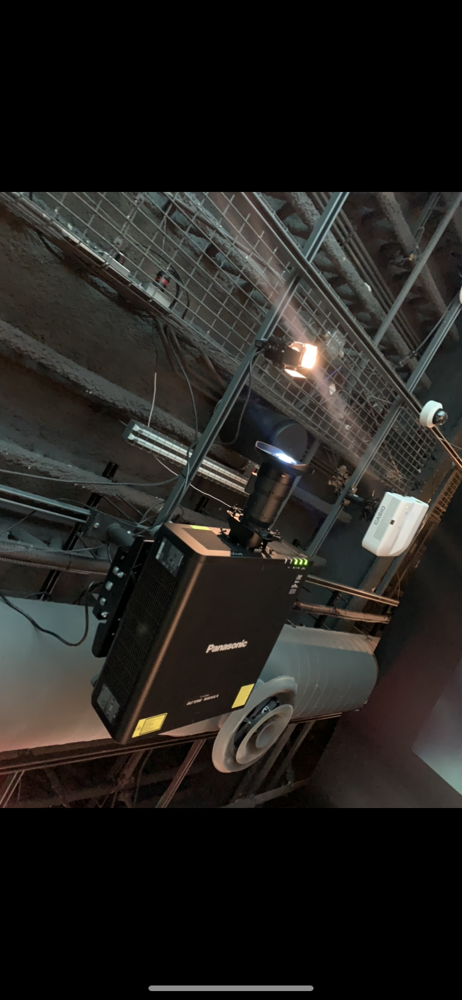
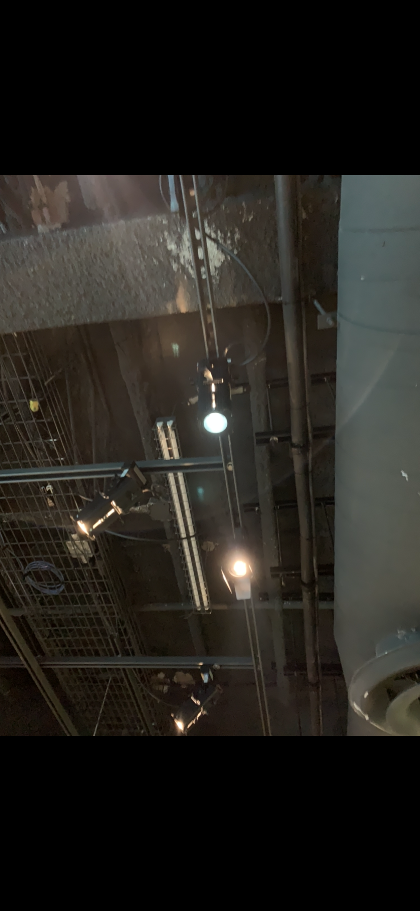
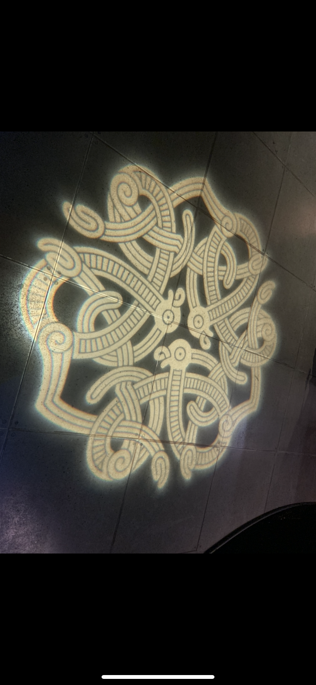
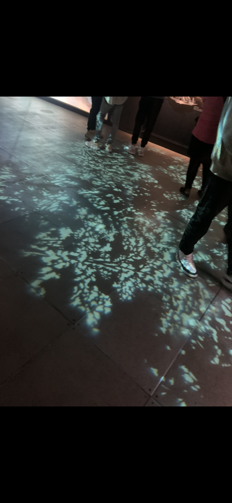

#Titre de l'oeuvre ou de la réalisation:

## Vikings-Dragons des mers du Nord

# Nom de l'artiste ou de la société :
## Musée national de Danemark et MuseumsPartner en collaboration avec Ubisoft 

# Année de réalisation:
## Aucune date n'a été mensionner

# Nom de l'exposition ou de l'événement:
## Vikings-Dragons des mers du Nord

# Lieu de mise en exposition:
## À Montréal (Québec,Canada) Dans 2 grandes salles

# Date de votre visite:
## 30 Avril 2022

# Description de l'oeuvre ou du dispositif multimédia (à composer ou reprendre la description offerte sur le site de l'artiste ou le cartel de l'exposition en citant bien sa source):
## Pour la première fois au Québec, et en exclusivité, le Musée accueille l’exceptionnelle collection viking du Musée national du Danemark, une des plus belles au monde !Bijoux et parures d’une grande finesse, armes, outils et objets du quotidien… Découvrez 650 pièces authentiques de l’Âge des Vikings, dont certaines n’ont encore jamais été présentées en Amérique du Nord. Adoptant une approche originale où mythologie et réalité s’entrecroisent, VIKINGS – Dragons des mers du Nord vous invite à une captivante immersion dans le monde à la fois réel et imaginaire de ce peuple légendaire. Le tout, dans une scénographie à couper le souffle, ponctuée d'images du jeu Assassin’s Creed Valhalla d’Ubisoft Montréal.
### Ce texte est insipré du site de l'exposition voir référence ci-dessous

# Explications sur la mise en espace de l'oeuvre ou du dispositif (texte à composer):
  ## Lors de ma visite, de nombreux oeuvres sur le même thème sont disposés aux visiteurs et  comme vous ne le saviez sans doute pas cette visite s'est déroulé en 2 parties. Durant la 1er partie nous avons pu assister aux origines des vikings et au récit de leur vie au quotidien.Puis lors de la 2e partie, nous avons pu assiter au recit de leurs voyages et au récit de la fin des temps.

# Liste des composantes et techniques de l'oeuvre ou du dispositif (ex. : réalité virtuelle, projecteurs, caméra USB, anneau lumineux...):
## Projecteurs

## Lumières+design

## beaucoup de lumieres et de design de ce type dans les salles

# Liste des éléments nécessaires pour la mise en exposition (ex. : crochets, sac de sable, câbles de soutien...):
## Câbles electr, support mural téléviseur.

# Expérience vécue :
## Je ne m'y attenais pas  du tout, à assister en présence d'autant expositions centré sur le même thème Vikings. Il en fait aucun doute que quiconque s'y croyait à leur éepoque la façon dont que les spectateurs etait immersifs.

# Description de votre expérience de l'oeuvre ou du dispositif, de l'interactivité, des gestes à poser, etc:
## Du fait qu'il y avait de nombreux oeuvres mais concentré sur le même sujet (Vikings) la seule manière qu'on pouvait interrargir avec une oeuvre ce n'était que de se poser près d'un écran et un monsieur qui prend la personnalité et qui est déguisé tel un  Viking nous racontait un récit du fonctionnement des Vikings par exemple leur mode de vie et ou les grandes voyages qu'ils entreprenaient.

# Ce qui vous a plu, vous a donné des idées et justifications:
## Ce qui m'a plu c'est le fait d'avoir  autant d'expositions sur le même sujet afin que que les spectateurs soient complètement immersifs lors de la visite.

### Aspect que vous ne souhaiteriez pas retenir pour vos propres créations ou que vous feriez autrement et justifications:

# Références:
https://pacmusee.qc.ca/fr/expositions/detail/vikings-dragons-des-mers-du-nord/
## Mes connaissances
